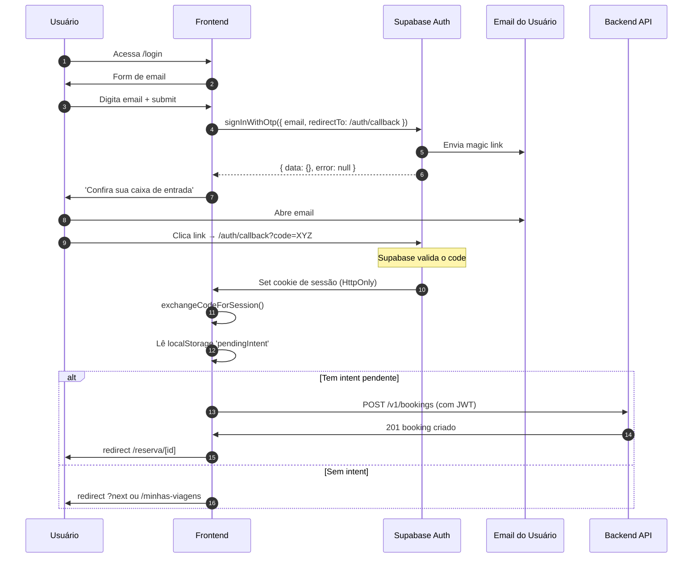

# User Flows — Buscou Viajou (Demo)

> Fluxos principais do cliente. Cada flow é um diagrama Mermaid + tabela
> de transições com endpoints da API e estados resultantes.

## Flow 1 — Cliente anônimo → primeira reserva

Caminho mais importante da demo. Da landing até o bilhete digital.

```mermaid
flowchart TD
    A[Anônimo entra em /]:::page --> B{Preenche<br/>formulário}
    B -->|Origem, destino, data, passageiros| C[Submit busca]
    C -->|POST /v1/quotes| D[/busca/]:::page
    D --> E{Filtra/ordena?}
    E -->|sim| D
    E -->|não| F[Clica em<br/>VehicleResultCard]
    F --> G[/veiculo/id/]:::page
    G --> H{Quer reservar?}
    H -->|não| D
    H -->|sim| I[Clica<br/>'Solicitar Reserva']
    I --> J{Está logado?}
    J -->|não| K[/login?next=/veiculo/id/]:::page
    K --> L[Digita email]
    L -->|signInWithOtp| M[Email enviado<br/>'Confira sua caixa']:::state
    M -.->|usuário clica<br/>no link| N[/auth/callback?code=.../]:::page
    N -->|exchangeCodeForSession| O[/veiculo/id/]:::page
    O --> P[Volta com sessão<br/>+ retoma intent]
    P --> Q[POST /v1/bookings]
    Q --> R[/reserva/id/]:::page
    R --> S{Status PENDING_APPROVAL}
    S --> T[Card 'Aguardando aprovação<br/>da empresa']
    T --> U[Botão DEMO<br/>'Simular aprovação + pagamento']
    U -->|POST /bookings/id/_demo/<br/>approve-and-pay| V[Status CONFIRMED]
    V --> W[GET /bookings/id/ticket]
    W --> X[Bilhete digital<br/>QR code + dados]:::state
    X --> Y([Fim — viagem confirmada])

    classDef page fill:#0B2A43,stroke:#0B2A43,color:#fff
    classDef state fill:#2B9366,stroke:#2B9366,color:#fff
```



**Tempo médio esperado** (sem distrações): 3-4 minutos.

### Tabela de etapas

| # | Tela / Ação | Endpoint | Estado resultante |
|---|---|---|---|
| 1 | Anônimo em `/` | — | — |
| 2 | Preenche `SearchForm` | `GET /v1/cities/search` (autocomplete) | Form válido |
| 3 | Submit | `POST /v1/quotes` | `locked_quotes` criadas (30min) |
| 4 | `/busca` | já tem resposta | Lista renderizada |
| 5 | Filtra/ordena (client-side) | — | Sublist filtrada |
| 6 | Clica card | — | `next=/veiculo/[id]` na URL |
| 7 | `/veiculo/[id]` | `GET /v1/vehicles/:id` + `:id/reviews` | Detalhe carregado |
| 8 | Clica "Solicitar Reserva" | (sem chamada se logado) | — |
| 9 | Redireciona `/login` se anônimo | — | Salva `lockedQuoteId` em localStorage |
| 10 | Email OTP | `supabase.auth.signInWithOtp` | Email enviado |
| 11 | Click no email → `/auth/callback` | `supabase.auth.exchangeCodeForSession` | Cookie de sessão |
| 12 | Redireciona `next` | — | Volta pra `/veiculo/[id]` |
| 13 | Auto-submit reserva | `POST /v1/bookings` | Status `PENDING_APPROVAL` |
| 14 | `/reserva/[id]` | já tem | Renderiza estado |
| 15 | Botão DEMO | `POST /bookings/:id/_demo/approve-and-pay` | Status `CONFIRMED` |
| 16 | Bilhete | `GET /bookings/:id/ticket` | QR + dados |

### Flow alternativo 1a — Sem resultados na busca

Quando `POST /v1/quotes` retorna 0 veículos.

```
/busca → empty state ilustrativo
       → CTA "Tentar outra data" (volta pra /)
       → CTA "Editar filtros" (abre filtros sidebar)
```

### Flow alternativo 1b — Cidade inválida

Quando o usuário digita cidade não conhecida.

```
/busca → 400 Bad Request
       → toast: "Não encontramos essa cidade. Tente São Paulo, Rio, BH, etc."
       → permanece no form sem submeter
```

### Flow alternativo 1c — Cotação expirou (>30min)

Cliente demora pra finalizar reserva, `lockedQuote.locked_until` expira.

```
POST /v1/bookings → 400 "Cotação expirada — refaça a busca"
                  → toast com CTA "Refazer busca"
                  → redireciona pra /busca preservando origem/destino
```

---

## Flow 2 — Cliente retorna pra ver suas viagens

```mermaid
flowchart TD
    A[Cliente acessa /minhas-viagens]:::page --> B{Logado?}
    B -->|não| C[/login?next=/minhas-viagens]:::page
    B -->|sim| D[GET /v1/bookings]
    D --> E[/minhas-viagens/]:::page
    E --> F{Tem reservas?}
    F -->|não| G[Empty state<br/>'Que tal a primeira viagem?']:::state
    G --> H[CTA → /]
    F -->|sim| I[Tabs por status]
    I --> J[Próximas / Em andamento /<br/>Concluídas / Canceladas]
    J --> K[Lista de BookingCard]
    K --> L{Clica em card}
    L --> M[/reserva/id/]:::page
    M --> N{Status}
    N -->|CONFIRMED| O[Bilhete + 'Cancelar']
    N -->|COMPLETED| P[Resumo + 'Avaliar']
    N -->|CANCELLED_*| Q[Resumo + reembolso]
    N -->|PENDING_*| R[Card de aguardando]

    classDef page fill:#0B2A43,stroke:#0B2A43,color:#fff
    classDef state fill:#2B9366,stroke:#2B9366,color:#fff
```

### Subflow 2a — Cancelamento pelo cliente

Aplica `RN-FIN-002` (PRD §12.3).

```mermaid
flowchart LR
    A[/reserva/id/<br/>status CONFIRMED]:::page --> B[Clica 'Cancelar']
    B --> C[Modal:<br/>política de reembolso]:::state
    C --> D{Hora da viagem<br/>vs agora?}
    D -->|>72h| E[100% reembolso]
    D -->|24-72h| F[50% reembolso<br/>50% multa]
    D -->|<24h| G[Sem reembolso]
    E --> H[Textarea<br/>'Motivo do cancelamento']
    F --> H
    G --> H
    H --> I[Confirma]
    I --> J[POST /bookings/id/cancel]
    J --> K[Status<br/>CANCELLED_BY_CLIENT]
    K --> L[Toast confirmando<br/>+ valor do reembolso]:::state
    L --> M[/minhas-viagens<br/>tab 'Canceladas']:::page

    classDef page fill:#0B2A43,stroke:#0B2A43,color:#fff
    classDef state fill:#2B9366,stroke:#2B9366,color:#fff
```

---

## Flow 3 — Auth (magic link)

Detalhe técnico do flow de autenticação. Usado pelos flows 1 e 2.



### Magic link — pontos de atenção

| Item | Detalhe |
|---|---|
| Provedor de email | **Supabase Auth nativo** (sem custo até 4 emails/h) |
| Template do email | Default em pt-BR; customizar com marca em Fase 2 |
| Expiração do link | 1 hora (config Supabase) |
| Reenvio | Botão "Reenviar email" no /login com cooldown de 60s |
| Email não chegou | Toast "Verifique spam/lixo eletrônico" + link de reenvio |
| Code inválido/expirado | `/auth/erro` com CTA "Voltar pro login" |
| Próxima rota | Query param `?next=` preservado pelo middleware |
| Intent pendente | `localStorage.pendingBookingIntent = { lockedQuoteId, ... }` retomado pós-login |

---

## Flow 4 — Sair / logout

```
[Avatar Menu] → "Sair" → supabase.auth.signOut() → redirect /
```

Sem confirmação, ação instantânea, toast "Até logo!".

---

## Decisões UX explícitas

### Por que magic link sem senha?

- Reduz fricção (sem cadastro, sem senha esquecida)
- Supabase Auth nativo, zero custo
- Alinhado com voz da marca: "simples, direto"
- Trade-off: cada login pede email. Mitigado com sessão de 7 dias

### Por que retomar intent após login (não pedir reserva de novo)?

- O cliente já escolheu o veículo, não queremos perdê-lo no funil
- `localStorage` segura `lockedQuoteId` durante magic link round-trip
- Se a cotação expirou no meio (>30min), avisa e oferece refazer

### Por que botão DEMO de aprovação?

- Em produção: empresa parceira aprova manualmente (UC-002, ~24h SLA)
- Na demo: precisamos mostrar o fluxo completo em 3min
- Botão visível apenas em status `PENDING_APPROVAL`
- Texto: *"Simular aprovação da empresa (demo)"* — explícito que é mock
- Em produção: removido + adicionado fluxo real Stripe Checkout

### Por que não SMS OTP (como o PRD pede)?

- SMS exige config de Twilio/MessageBird dentro do Supabase
- Custo: ~R$0,15 por SMS no Brasil
- Para demo: email OTP é suficiente e gratuito
- Em produção: trocar pra SMS é mudar 2 linhas no `signInWithOtp`

---

## Resumo — Caminho crítico (que precisa estar PERFEITO)

> Esses são os passos onde nenhum bug pode acontecer. Foco do `@critical` E2E.

```
/ → /busca → /veiculo/[id] → /login → /auth/callback → /veiculo/[id]
  → POST /bookings → /reserva/[id] → DEMO approve → ticket QR
```

8 transições. Cada uma com loading + error states robustos.
Tempo total: <2 minutos de execução automatizada.
